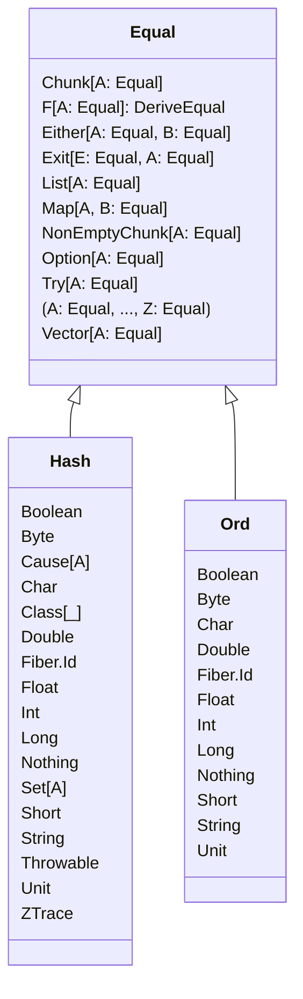

# Equal

<img src="data:image/svg+xml;base64,PHN2ZyBpZD0ibWVybWFpZC0xNjAxNTA0NjQ5NjkxIiB3aWR0aD0iMTAwJSIgeG1sbnM9Imh0dHA6Ly93d3cudzMub3JnLzIwMDAvc3ZnIiB4bWxuczp4bGluaz0iaHR0cDovL3d3dy53My5vcmcvMTk5OS94bGluayIgaGVpZ2h0PSI0NDIiIHN0eWxlPSJtYXgtd2lkdGg6IDIwN3B4OyIgdmlld0JveD0iLTIwIC0yMCAyMDcgNDQyIj48c3R5bGU+I21lcm1haWQtMTYwMTUwNDY0OTY5MXtmb250LWZhbWlseToidHJlYnVjaGV0IG1zIix2ZXJkYW5hLGFyaWFsO2ZvbnQtc2l6ZToxNnB4O2ZpbGw6IzMzMzt9I21lcm1haWQtMTYwMTUwNDY0OTY5MSAuZXJyb3ItaWNvbntmaWxsOiM1NTIyMjI7fSNtZXJtYWlkLTE2MDE1MDQ2NDk2OTEgLmVycm9yLXRleHR7ZmlsbDojNTUyMjIyO3N0cm9rZTojNTUyMjIyO30jbWVybWFpZC0xNjAxNTA0NjQ5NjkxIC5lZGdlLXRoaWNrbmVzcy1ub3JtYWx7c3Ryb2tlLXdpZHRoOjJweDt9I21lcm1haWQtMTYwMTUwNDY0OTY5MSAuZWRnZS10aGlja25lc3MtdGhpY2t7c3Ryb2tlLXdpZHRoOjMuNXB4O30jbWVybWFpZC0xNjAxNTA0NjQ5NjkxIC5lZGdlLXBhdHRlcm4tc29saWR7c3Ryb2tlLWRhc2hhcnJheTowO30jbWVybWFpZC0xNjAxNTA0NjQ5NjkxIC5lZGdlLXBhdHRlcm4tZGFzaGVke3N0cm9rZS1kYXNoYXJyYXk6Mzt9I21lcm1haWQtMTYwMTUwNDY0OTY5MSAuZWRnZS1wYXR0ZXJuLWRvdHRlZHtzdHJva2UtZGFzaGFycmF5OjI7fSNtZXJtYWlkLTE2MDE1MDQ2NDk2OTEgLm1hcmtlcntmaWxsOiMzMzMzMzM7fSNtZXJtYWlkLTE2MDE1MDQ2NDk2OTEgLm1hcmtlci5jcm9zc3tzdHJva2U6IzMzMzMzMzt9I21lcm1haWQtMTYwMTUwNDY0OTY5MSBzdmd7Zm9udC1mYW1pbHk6InRyZWJ1Y2hldCBtcyIsdmVyZGFuYSxhcmlhbDtmb250LXNpemU6MTZweDt9I21lcm1haWQtMTYwMTUwNDY0OTY5MSBnLmNsYXNzR3JvdXAgdGV4dHtmaWxsOiM5MzcwREI7ZmlsbDojMTMxMzAwO3N0cm9rZTpub25lO2ZvbnQtZmFtaWx5OiJ0cmVidWNoZXQgbXMiLHZlcmRhbmEsYXJpYWw7Zm9udC1zaXplOjEwcHg7fSNtZXJtYWlkLTE2MDE1MDQ2NDk2OTEgZy5jbGFzc0dyb3VwIHRleHQgLnRpdGxle2ZvbnQtd2VpZ2h0OmJvbGRlcjt9I21lcm1haWQtMTYwMTUwNDY0OTY5MSAuY2xhc3NUaXRsZXtmb250LXdlaWdodDpib2xkZXI7fSNtZXJtYWlkLTE2MDE1MDQ2NDk2OTEgLm5vZGUgcmVjdCwjbWVybWFpZC0xNjAxNTA0NjQ5NjkxIC5ub2RlIGNpcmNsZSwjbWVybWFpZC0xNjAxNTA0NjQ5NjkxIC5ub2RlIGVsbGlwc2UsI21lcm1haWQtMTYwMTUwNDY0OTY5MSAubm9kZSBwb2x5Z29uLCNtZXJtYWlkLTE2MDE1MDQ2NDk2OTEgLm5vZGUgcGF0aHtmaWxsOiNFQ0VDRkY7c3Ryb2tlOiM5MzcwREI7c3Ryb2tlLXdpZHRoOjFweDt9I21lcm1haWQtMTYwMTUwNDY0OTY5MSAuZGl2aWRlcntzdHJva2U6IzkzNzBEQjtzdHJva2U6MTt9I21lcm1haWQtMTYwMTUwNDY0OTY5MSBnLmNsaWNrYWJsZXtjdXJzb3I6cG9pbnRlcjt9I21lcm1haWQtMTYwMTUwNDY0OTY5MSBnLmNsYXNzR3JvdXAgcmVjdHtmaWxsOiNFQ0VDRkY7c3Ryb2tlOiM5MzcwREI7fSNtZXJtYWlkLTE2MDE1MDQ2NDk2OTEgZy5jbGFzc0dyb3VwIGxpbmV7c3Ryb2tlOiM5MzcwREI7c3Ryb2tlLXdpZHRoOjE7fSNtZXJtYWlkLTE2MDE1MDQ2NDk2OTEgLmNsYXNzTGFiZWwgLmJveHtzdHJva2U6bm9uZTtzdHJva2Utd2lkdGg6MDtmaWxsOiNFQ0VDRkY7b3BhY2l0eTowLjU7fSNtZXJtYWlkLTE2MDE1MDQ2NDk2OTEgLmNsYXNzTGFiZWwgLmxhYmVse2ZpbGw6IzkzNzBEQjtmb250LXNpemU6MTBweDt9I21lcm1haWQtMTYwMTUwNDY0OTY5MSAucmVsYXRpb257c3Ryb2tlOiMzMzMzMzM7c3Ryb2tlLXdpZHRoOjE7ZmlsbDpub25lO30jbWVybWFpZC0xNjAxNTA0NjQ5NjkxIC5kYXNoZWQtbGluZXtzdHJva2UtZGFzaGFycmF5OjM7fSNtZXJtYWlkLTE2MDE1MDQ2NDk2OTEgI2NvbXBvc2l0aW9uU3RhcnQsI21lcm1haWQtMTYwMTUwNDY0OTY5MSAuY29tcG9zaXRpb257ZmlsbDojMzMzMzMzICFpbXBvcnRhbnQ7c3Ryb2tlOiMzMzMzMzMgIWltcG9ydGFudDtzdHJva2Utd2lkdGg6MTt9I21lcm1haWQtMTYwMTUwNDY0OTY5MSAjY29tcG9zaXRpb25FbmQsI21lcm1haWQtMTYwMTUwNDY0OTY5MSAuY29tcG9zaXRpb257ZmlsbDojMzMzMzMzICFpbXBvcnRhbnQ7c3Ryb2tlOiMzMzMzMzMgIWltcG9ydGFudDtzdHJva2Utd2lkdGg6MTt9I21lcm1haWQtMTYwMTUwNDY0OTY5MSAjZGVwZW5kZW5jeVN0YXJ0LCNtZXJtYWlkLTE2MDE1MDQ2NDk2OTEgLmRlcGVuZGVuY3l7ZmlsbDojMzMzMzMzICFpbXBvcnRhbnQ7c3Ryb2tlOiMzMzMzMzMgIWltcG9ydGFudDtzdHJva2Utd2lkdGg6MTt9I21lcm1haWQtMTYwMTUwNDY0OTY5MSAjZGVwZW5kZW5jeVN0YXJ0LCNtZXJtYWlkLTE2MDE1MDQ2NDk2OTEgLmRlcGVuZGVuY3l7ZmlsbDojMzMzMzMzICFpbXBvcnRhbnQ7c3Ryb2tlOiMzMzMzMzMgIWltcG9ydGFudDtzdHJva2Utd2lkdGg6MTt9I21lcm1haWQtMTYwMTUwNDY0OTY5MSAjZXh0ZW5zaW9uU3RhcnQsI21lcm1haWQtMTYwMTUwNDY0OTY5MSAuZXh0ZW5zaW9ue2ZpbGw6IzMzMzMzMyAhaW1wb3J0YW50O3N0cm9rZTojMzMzMzMzICFpbXBvcnRhbnQ7c3Ryb2tlLXdpZHRoOjE7fSNtZXJtYWlkLTE2MDE1MDQ2NDk2OTEgI2V4dGVuc2lvbkVuZCwjbWVybWFpZC0xNjAxNTA0NjQ5NjkxIC5leHRlbnNpb257ZmlsbDojMzMzMzMzICFpbXBvcnRhbnQ7c3Ryb2tlOiMzMzMzMzMgIWltcG9ydGFudDtzdHJva2Utd2lkdGg6MTt9I21lcm1haWQtMTYwMTUwNDY0OTY5MSAjYWdncmVnYXRpb25TdGFydCwjbWVybWFpZC0xNjAxNTA0NjQ5NjkxIC5hZ2dyZWdhdGlvbntmaWxsOiNFQ0VDRkYgIWltcG9ydGFudDtzdHJva2U6IzMzMzMzMyAhaW1wb3J0YW50O3N0cm9rZS13aWR0aDoxO30jbWVybWFpZC0xNjAxNTA0NjQ5NjkxICNhZ2dyZWdhdGlvbkVuZCwjbWVybWFpZC0xNjAxNTA0NjQ5NjkxIC5hZ2dyZWdhdGlvbntmaWxsOiNFQ0VDRkYgIWltcG9ydGFudDtzdHJva2U6IzMzMzMzMyAhaW1wb3J0YW50O3N0cm9rZS13aWR0aDoxO30jbWVybWFpZC0xNjAxNTA0NjQ5NjkxIC5lZGdlVGVybWluYWxze2ZvbnQtc2l6ZToxMXB4O30jbWVybWFpZC0xNjAxNTA0NjQ5NjkxOnJvb3R7LS1tZXJtYWlkLWZvbnQtZmFtaWx5OiJ0cmVidWNoZXQgbXMiLHZlcmRhbmEsYXJpYWw7fSNtZXJtYWlkLTE2MDE1MDQ2NDk2OTEgY2xhc3N7ZmlsbDphcGE7fTwvc3R5bGU+PGc+PC9nPjxkZWZzPjxtYXJrZXIgaWQ9ImV4dGVuc2lvblN0YXJ0IiBjbGFzcz0iZXh0ZW5zaW9uIiByZWZYPSIwIiByZWZZPSI3IiBtYXJrZXJXaWR0aD0iMTkwIiBtYXJrZXJIZWlnaHQ9IjI0MCIgb3JpZW50PSJhdXRvIj48cGF0aCBkPSJNIDEsNyBMMTgsMTMgViAxIFoiPjwvcGF0aD48L21hcmtlcj48L2RlZnM+PGRlZnM+PG1hcmtlciBpZD0iZXh0ZW5zaW9uRW5kIiByZWZYPSIxOSIgcmVmWT0iNyIgbWFya2VyV2lkdGg9IjIwIiBtYXJrZXJIZWlnaHQ9IjI4IiBvcmllbnQ9ImF1dG8iPjxwYXRoIGQ9Ik0gMSwxIFYgMTMgTDE4LDcgWiI+PC9wYXRoPjwvbWFya2VyPjwvZGVmcz48ZGVmcz48bWFya2VyIGlkPSJjb21wb3NpdGlvblN0YXJ0IiBjbGFzcz0iZXh0ZW5zaW9uIiByZWZYPSIwIiByZWZZPSI3IiBtYXJrZXJXaWR0aD0iMTkwIiBtYXJrZXJIZWlnaHQ9IjI0MCIgb3JpZW50PSJhdXRvIj48cGF0aCBkPSJNIDE4LDcgTDksMTMgTDEsNyBMOSwxIFoiPjwvcGF0aD48L21hcmtlcj48L2RlZnM+PGRlZnM+PG1hcmtlciBpZD0iY29tcG9zaXRpb25FbmQiIHJlZlg9IjE5IiByZWZZPSI3IiBtYXJrZXJXaWR0aD0iMjAiIG1hcmtlckhlaWdodD0iMjgiIG9yaWVudD0iYXV0byI+PHBhdGggZD0iTSAxOCw3IEw5LDEzIEwxLDcgTDksMSBaIj48L3BhdGg+PC9tYXJrZXI+PC9kZWZzPjxkZWZzPjxtYXJrZXIgaWQ9ImFnZ3JlZ2F0aW9uU3RhcnQiIGNsYXNzPSJleHRlbnNpb24iIHJlZlg9IjAiIHJlZlk9IjciIG1hcmtlcldpZHRoPSIxOTAiIG1hcmtlckhlaWdodD0iMjQwIiBvcmllbnQ9ImF1dG8iPjxwYXRoIGQ9Ik0gMTgsNyBMOSwxMyBMMSw3IEw5LDEgWiI+PC9wYXRoPjwvbWFya2VyPjwvZGVmcz48ZGVmcz48bWFya2VyIGlkPSJhZ2dyZWdhdGlvbkVuZCIgcmVmWD0iMTkiIHJlZlk9IjciIG1hcmtlcldpZHRoPSIyMCIgbWFya2VySGVpZ2h0PSIyOCIgb3JpZW50PSJhdXRvIj48cGF0aCBkPSJNIDE4LDcgTDksMTMgTDEsNyBMOSwxIFoiPjwvcGF0aD48L21hcmtlcj48L2RlZnM+PGRlZnM+PG1hcmtlciBpZD0iZGVwZW5kZW5jeVN0YXJ0IiBjbGFzcz0iZXh0ZW5zaW9uIiByZWZYPSIwIiByZWZZPSI3IiBtYXJrZXJXaWR0aD0iMTkwIiBtYXJrZXJIZWlnaHQ9IjI0MCIgb3JpZW50PSJhdXRvIj48cGF0aCBkPSJNIDUsNyBMOSwxMyBMMSw3IEw5LDEgWiI+PC9wYXRoPjwvbWFya2VyPjwvZGVmcz48ZGVmcz48bWFya2VyIGlkPSJkZXBlbmRlbmN5RW5kIiByZWZYPSIxOSIgcmVmWT0iNyIgbWFya2VyV2lkdGg9IjIwIiBtYXJrZXJIZWlnaHQ9IjI4IiBvcmllbnQ9ImF1dG8iPjxwYXRoIGQ9Ik0gMTgsNyBMOSwxMyBMMTQsNyBMOSwxIFoiPjwvcGF0aD48L21hcmtlcj48L2RlZnM+PGcgaWQ9ImNsYXNzaWQtRXF1YWwtMTUiIGNsYXNzPSJjbGFzc0dyb3VwIiB0cmFuc2Zvcm09InRyYW5zbGF0ZSgxNi4yNSwwICkiPjxyZWN0IHg9IjAiIHk9IjAiIHdpZHRoPSIxMzkiIGhlaWdodD0iMTQ2IiBjbGFzcz0iICI+PC9yZWN0Pjx0ZXh0IHk9IjE1IiB4PSIwIj48dHNwYW4gY2xhc3M9InRpdGxlIiB4PSI1NS41Ij5FcXVhbDwvdHNwYW4+PC90ZXh0PjxsaW5lIHgxPSIwIiB5MT0iMjMiIHkyPSIyMyIgeDI9IjEzOSI+PC9saW5lPjx0ZXh0IHg9IjUiIHk9IjMzIiBmaWxsPSJ3aGl0ZSIgY2xhc3M9ImNsYXNzVGV4dCI+PHRzcGFuIHg9IjUiPkNodW5rW0E6IEVxdWFsXTwvdHNwYW4+PHRzcGFuIHg9IjUiIGR5PSIxMCI+RltBOiBFcXVhbF06IERlcml2ZUVxdWFsPC90c3Bhbj48dHNwYW4geD0iNSIgZHk9IjEwIj5FaXRoZXJbQTogRXF1YWwsIEI6IEVxdWFsXTwvdHNwYW4+PHRzcGFuIHg9IjUiIGR5PSIxMCI+RXhpdFtFOiBFcXVhbCwgQTogRXF1YWxdPC90c3Bhbj48dHNwYW4geD0iNSIgZHk9IjEwIj5MaXN0W0E6IEVxdWFsXTwvdHNwYW4+PHRzcGFuIHg9IjUiIGR5PSIxMCI+TWFwW0EsIEI6IEVxdWFsXTwvdHNwYW4+PHRzcGFuIHg9IjUiIGR5PSIxMCI+Tm9uRW1wdHlDaHVua1tBOiBFcXVhbF08L3RzcGFuPjx0c3BhbiB4PSI1IiBkeT0iMTAiPk9wdGlvbltBOiBFcXVhbF08L3RzcGFuPjx0c3BhbiB4PSI1IiBkeT0iMTAiPlRyeVtBOiBFcXVhbF08L3RzcGFuPjx0c3BhbiB4PSI1IiBkeT0iMTAiPuKfrkE6IEVxdWFsLCAuLi4sIFo6IEVxdWFs4p+vPC90c3Bhbj48dHNwYW4geD0iNSIgZHk9IjEwIj5WZWN0b3JbQTogRXF1YWxdPC90c3Bhbj48L3RleHQ+PGxpbmUgeDE9IjAiIHkxPSIxNDEiIHkyPSIxNDEiIHgyPSIxMzkiPjwvbGluZT48dGV4dCB4PSI1IiB5PSIxNTYiIGZpbGw9IndoaXRlIiBjbGFzcz0iY2xhc3NUZXh0Ij48L3RleHQ+PC9nPjxnIGlkPSJjbGFzc2lkLUhhc2gtMTYiIGNsYXNzPSJjbGFzc0dyb3VwIiB0cmFuc2Zvcm09InRyYW5zbGF0ZSgwLDE5NiApIj48cmVjdCB4PSIwIiB5PSIwIiB3aWR0aD0iNjMiIGhlaWdodD0iMjA2IiBjbGFzcz0iICI+PC9yZWN0Pjx0ZXh0IHk9IjE1IiB4PSIwIj48dHNwYW4gY2xhc3M9InRpdGxlIiB4PSIxOSI+SGFzaDwvdHNwYW4+PC90ZXh0PjxsaW5lIHgxPSIwIiB5MT0iMjMiIHkyPSIyMyIgeDI9IjYzIj48L2xpbmU+PHRleHQgeD0iNSIgeT0iMzMiIGZpbGw9IndoaXRlIiBjbGFzcz0iY2xhc3NUZXh0Ij48dHNwYW4geD0iNSI+Qm9vbGVhbjwvdHNwYW4+PHRzcGFuIHg9IjUiIGR5PSIxMCI+Qnl0ZTwvdHNwYW4+PHRzcGFuIHg9IjUiIGR5PSIxMCI+Q2F1c2VbQV08L3RzcGFuPjx0c3BhbiB4PSI1IiBkeT0iMTAiPkNoYXI8L3RzcGFuPjx0c3BhbiB4PSI1IiBkeT0iMTAiPkNsYXNzW19dPC90c3Bhbj48dHNwYW4geD0iNSIgZHk9IjEwIj5Eb3VibGU8L3RzcGFuPjx0c3BhbiB4PSI1IiBkeT0iMTAiPkZpYmVyLklkPC90c3Bhbj48dHNwYW4geD0iNSIgZHk9IjEwIj5GbG9hdDwvdHNwYW4+PHRzcGFuIHg9IjUiIGR5PSIxMCI+SW50PC90c3Bhbj48dHNwYW4geD0iNSIgZHk9IjEwIj5Mb25nPC90c3Bhbj48dHNwYW4geD0iNSIgZHk9IjEwIj5Ob3RoaW5nPC90c3Bhbj48dHNwYW4geD0iNSIgZHk9IjEwIj5TZXRbQV08L3RzcGFuPjx0c3BhbiB4PSI1IiBkeT0iMTAiPlNob3J0PC90c3Bhbj48dHNwYW4geD0iNSIgZHk9IjEwIj5TdHJpbmc8L3RzcGFuPjx0c3BhbiB4PSI1IiBkeT0iMTAiPlRocm93YWJsZTwvdHNwYW4+PHRzcGFuIHg9IjUiIGR5PSIxMCI+VW5pdDwvdHNwYW4+PHRzcGFuIHg9IjUiIGR5PSIxMCI+WlRyYWNlPC90c3Bhbj48L3RleHQ+PGxpbmUgeDE9IjAiIHkxPSIyMDEiIHkyPSIyMDEiIHgyPSI2MyI+PC9saW5lPjx0ZXh0IHg9IjUiIHk9IjIxNiIgZmlsbD0id2hpdGUiIGNsYXNzPSJjbGFzc1RleHQiPjwvdGV4dD48L2c+PGcgaWQ9ImNsYXNzaWQtT3JkLTE3IiBjbGFzcz0iY2xhc3NHcm91cCIgdHJhbnNmb3JtPSJ0cmFuc2xhdGUoMTEzLDIyMSApIj48cmVjdCB4PSIwIiB5PSIwIiB3aWR0aD0iNTQiIGhlaWdodD0iMTU2IiBjbGFzcz0iICI+PC9yZWN0Pjx0ZXh0IHk9IjE1IiB4PSIwIj48dHNwYW4gY2xhc3M9InRpdGxlIiB4PSIxOCI+T3JkPC90c3Bhbj48L3RleHQ+PGxpbmUgeDE9IjAiIHkxPSIyMyIgeTI9IjIzIiB4Mj0iNTQiPjwvbGluZT48dGV4dCB4PSI1IiB5PSIzMyIgZmlsbD0id2hpdGUiIGNsYXNzPSJjbGFzc1RleHQiPjx0c3BhbiB4PSI1Ij5Cb29sZWFuPC90c3Bhbj48dHNwYW4geD0iNSIgZHk9IjEwIj5CeXRlPC90c3Bhbj48dHNwYW4geD0iNSIgZHk9IjEwIj5DaGFyPC90c3Bhbj48dHNwYW4geD0iNSIgZHk9IjEwIj5Eb3VibGU8L3RzcGFuPjx0c3BhbiB4PSI1IiBkeT0iMTAiPkZpYmVyLklkPC90c3Bhbj48dHNwYW4geD0iNSIgZHk9IjEwIj5GbG9hdDwvdHNwYW4+PHRzcGFuIHg9IjUiIGR5PSIxMCI+SW50PC90c3Bhbj48dHNwYW4geD0iNSIgZHk9IjEwIj5Mb25nPC90c3Bhbj48dHNwYW4geD0iNSIgZHk9IjEwIj5Ob3RoaW5nPC90c3Bhbj48dHNwYW4geD0iNSIgZHk9IjEwIj5TaG9ydDwvdHNwYW4+PHRzcGFuIHg9IjUiIGR5PSIxMCI+U3RyaW5nPC90c3Bhbj48dHNwYW4geD0iNSIgZHk9IjEwIj5Vbml0PC90c3Bhbj48L3RleHQ+PGxpbmUgeDE9IjAiIHkxPSIxNTEiIHkyPSIxNTEiIHgyPSI1NCI+PC9saW5lPjx0ZXh0IHg9IjUiIHk9IjE2NiIgZmlsbD0id2hpdGUiIGNsYXNzPSJjbGFzc1RleHQiPjwvdGV4dD48L2c+PHBhdGggZD0iTTQ1LjMzOTI4NTcxNDI4NTcxNSwxNDZMNDMuMDMyNzM4MDk1MjM4MDk1LDE1MC4xNjY2NjY2NjY2NjY2NkM0MC43MjYxOTA0NzYxOTA0NzQsMTU0LjMzMzMzMzMzMzMzMzM0LDM2LjExMzA5NTIzODA5NTI0LDE2Mi42NjY2NjY2NjY2NjY2NiwzMy44MDY1NDc2MTkwNDc2MiwxNzFDMzEuNSwxNzkuMzMzMzMzMzMzMzMzMzQsMzEuNSwxODcuNjY2NjY2NjY2NjY2NjYsMzEuNSwxOTEuODMzMzMzMzMzMzMzMzRMMzEuNSwxOTYiIGlkPSJlZGdlOCIgY2xhc3M9InJlbGF0aW9uIiBtYXJrZXItc3RhcnQ9InVybCgjZXh0ZW5zaW9uU3RhcnQpIj48L3BhdGg+PHBhdGggZD0iTTEyNi4xNjA3MTQyODU3MTQyOCwxNDZMMTI4LjQ2NzI2MTkwNDc2MTksMTUwLjE2NjY2NjY2NjY2NjY2QzEzMC43NzM4MDk1MjM4MDk1MiwxNTQuMzMzMzMzMzMzMzMzMzQsMTM1LjM4NjkwNDc2MTkwNDc2LDE2Mi42NjY2NjY2NjY2NjY2NiwxMzcuNjkzNDUyMzgwOTUyMzgsMTc1LjE2NjY2NjY2NjY2NjY2QzE0MCwxODcuNjY2NjY2NjY2NjY2NjYsMTQwLDIwNC4zMzMzMzMzMzMzMzMzNCwxNDAsMjEyLjY2NjY2NjY2NjY2NjY2TDE0MCwyMjEiIGlkPSJlZGdlOSIgY2xhc3M9InJlbGF0aW9uIiBtYXJrZXItc3RhcnQ9InVybCgjZXh0ZW5zaW9uU3RhcnQpIj48L3BhdGg+PC9zdmc+" alt="Equal hierarchy" width="500"/>

Code

