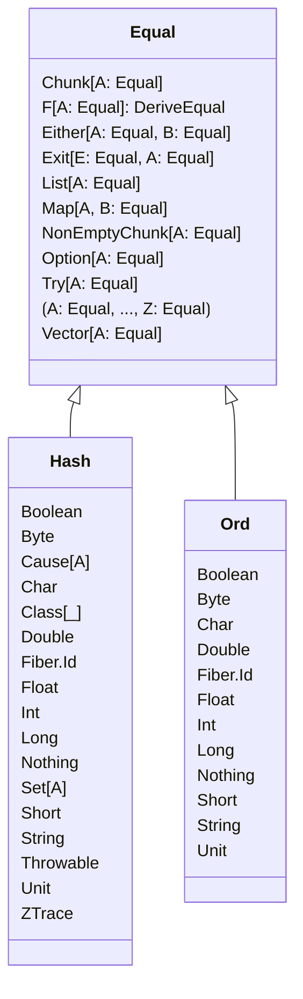

You can install the [Github + Mermaid](https://github.com/BackMarket/github-mermaid-extension#install) browser extension to view the diagrams rendered on GitHub.

# Equal

```mermaid
classDiagram
    Equal <|-- Hash
    Equal <|-- Ord
    class Equal {
      Chunk[A: Equal]
      F[A: Equal]: DeriveEqual
      Either[A: Equal, B: Equal]
      Exit[E: Equal, A: Equal]
      List[A: Equal]
      Map[A, B: Equal]
      NonEmptyChunk[A: Equal]
      Option[A: Equal]
      Try[A: Equal]
      ⟮A: Equal, ..., Z: Equal⟯
      Vector[A: Equal]
    }
    class Hash {
      Boolean
      Byte
      Cause[A]
      Char
      Class[_]
      Double
      Fiber.Id
      Float
      Int
      Long
      Nothing
      Set[A]
      Short
      String
      Throwable
      Unit
      ZTrace
    }
    class Ord {
      Boolean
      Byte
      Char
      Double
      Fiber.Id
      Float
      Int
      Long
      Nothing
      Short
      String
      Unit
    }
```
